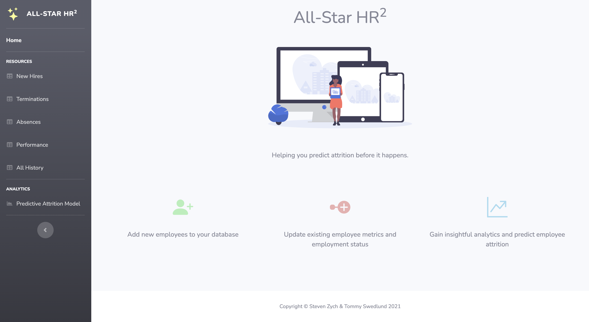
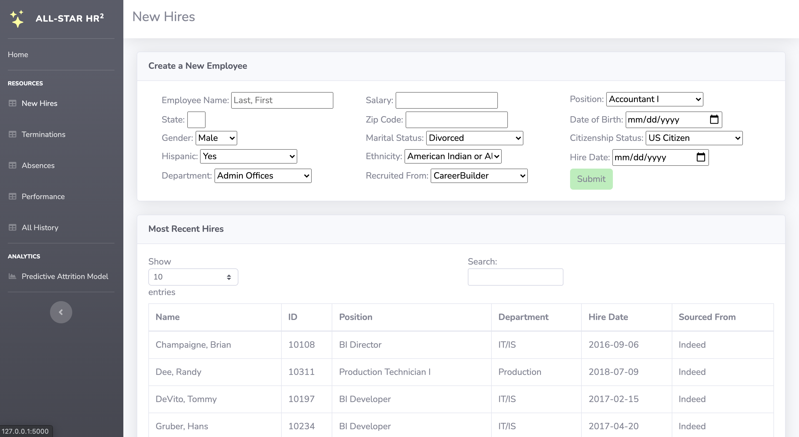
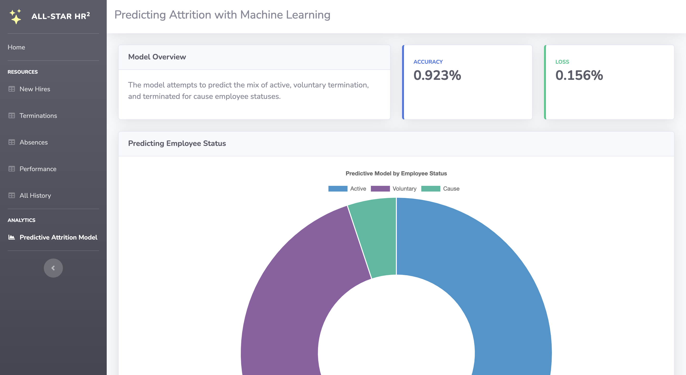

# All-Star HR^2

<!-- README -->
  <h3 align="center">Employee Attrition Web App</h3>
  
 
    How would your hiring strategies change if you were able to predict when an employee would leave your company?
     
    <a href="https://github.com/SteveZych/Final-Project/issues">Report Bug</a>
    ·
    <a href="https://github.com/SteveZych/Final-Project/issues">Request Feature</a>
  

<!-- TABLE OF CONTENTS -->

  
<h2 style="display: inline-block">Table of Contents</h2>

  <ol>
    <li>
      <a href="#about-the-project">About The Project</a>
    <li><a href="#built-with">Built With</a></li>
    <li><a href="#roadmap">Roadmap</a></li>
    <li><a href="#contributing">Contributing</a></li>
    <li><a href="#contact">Contact</a></li>
  </ol>

<!-- ABOUT THE PROJECT -->
## About The Project

Employees join and leave jobs for many different reasons. This project utilizes machine learning to model and predict employee status (active, attrition). 

*  User-Driven Data Gathering using HTML forms and SQLite (with Python)
*  Mimic an HR group corporate tool [using an example HR dataset](https://www.kaggle.com/rhuebner/human-resources-data-set)
*  Leverage Scikit + Python to develop a model that adapts to newly-entered data to continually form predictions

###### Concept & Notes
1. Questions we could potentially answer:
  - Can we predict when an employee will leave a job?
  - Can we predict the _percentage_ of employees that will leave a job? or stay?

2. Our technologies include:
  - Flask-powered API
  - SQLite
  - Pandas
  - Jupyter Notebook
  - Scikit-Learn
  - Kaggle
  - Tensorflow

<!-- BUILT WITH -->
## Built With
* Python
* HTML
* CSS
* JavaScript
* SQL

<!-- ROADMAP -->
## Roadmap

See the [open issues](https://github.com/SteveZych/Final-Project/issues) for a list of proposed features (and known issues).

<!-- CONTRIBUTING -->
## Contributing

Contributions are what make the open source community such an amazing place to be learn, inspire, and create. Any contributions you make are **greatly appreciated**.

1. Fork the Project
2. Create your Feature Branch (`git checkout -b feature/amazing_feature`)
3. Commit your Changes (`git commit -m 'Add some amazing_feature'`)
4. Push to the Branch (`git push origin feature/amazing_feature`)
5. Open a Pull Request

<!--SITE-->
## Site

<!-- CONTACT -->
## Contact

* [Steven](https://github.com/SteveZych)
* [Tommy](https://github.com/gldn-god/)

Project Link: [Employee Loss](https://github.com/SteveZych/Final-Project/)
